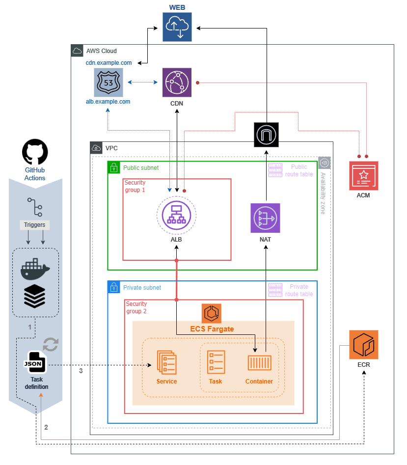

  

Welcome to year 2095. We are now living inside space-cities around 3.8 lightyears from Earth since our planet was completely dominated by Pluto's cyborg chimpanzees. We're also, as you should know, in the middle of the Fifth Suprasupercluster War. 
   
Feel the rush of being part of the acclaimed SPHFS/18 - Special Plasma Heavy Force Squad 18, and save us from the terrifying Y-23A Zorg, a mach-80 strobotic hypersonic magnetic cannon weapon. And remember: you can always be a SIGMA! :medal_military:

---                                                             
### 
 `OPERATION: ALPHA-BRAVO S4-DELTA/113-15 LMS33 CLASS:386-P52` 

---                                                            
#### Advices:

1. If you die (you will) use the browser reload [F5]
2. For ultimate performance use NVIDIA Ampere A100 80Gb GPU
3. We recommend the US-Army TEXTRON MARINE 5749739-023 Data Entry command keyboard
---
#### Controls (Advanced multidimensional handling techniques during combat): 

1. Hold up arrow to `move up` :arrow_up:
2. Hold down arrow to `move down` :arrow_down:
3. You need to bounce off the thermonuclear plasma bomb
----------
#### Instructions:

This game is only for study purposes and was designed to improve cloud, IaC and deployment pipeline skills. Some decisions doesn't make too much sense in real environments. 
 
The diagram below includes the infrastructure provisioned by the [terraformECSFargate](https://github.com/gstmoniz/terraformECSFargate) code.

